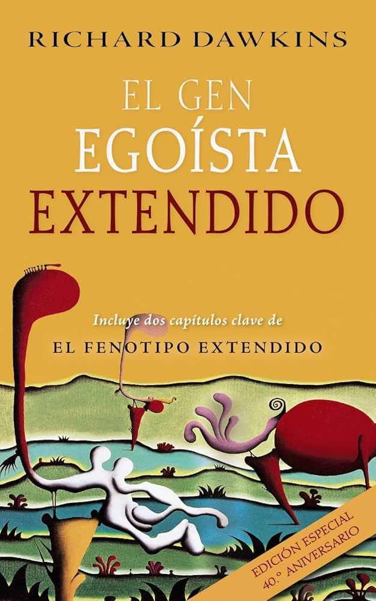
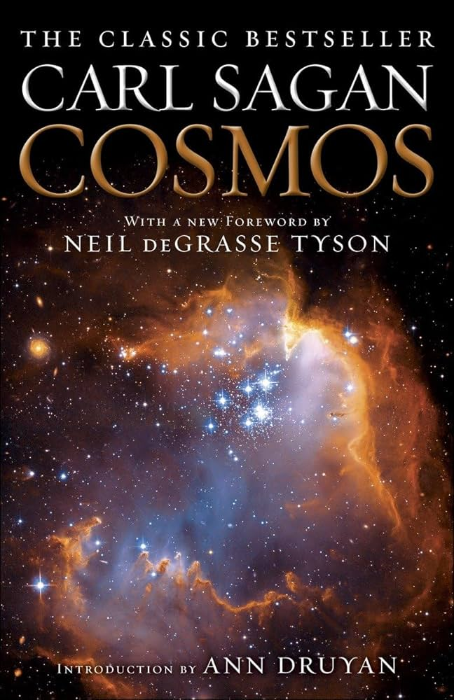

# Club de Divulgación Científica

## Agenda de Lecturas del Club

### Libros Seleccionados para Este Ciclo:

1. **Una Breve Historia del Tiempo** - *Stephen Hawking*  
     
   Año de Publicación: 1988  
   Género: Ciencia  
   Descripción: Una exploración de los secretos del universo.

2. **El Gen Egoísta** - *Richard Dawkins*  
     
   Año de Publicación: 1976  
   Género: Biología  
   Descripción: Un estudio profundo sobre la evolución y la genética.

3. **Cosmos** - *Carl Sagan*  
     
   Año de Publicación: 1980  
   Género: Ciencia  
   Descripción: Una obra icónica sobre el universo y la humanidad.

4. **Sapiens** - *Yuval Noah Harari*  
     
   Año de Publicación: 2011  
   Género: Historia  
   Descripción: Un análisis brillante sobre nuestra especie.

---

¡Descubre y comparte el conocimiento en nuestras sesiones!