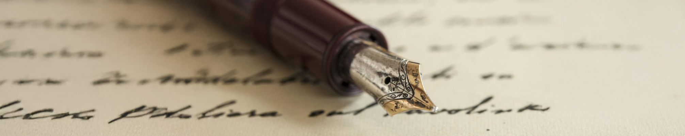
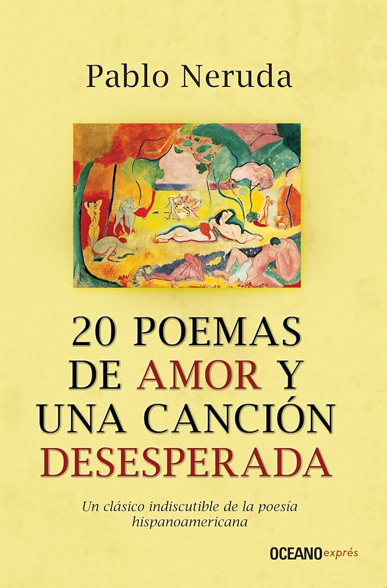
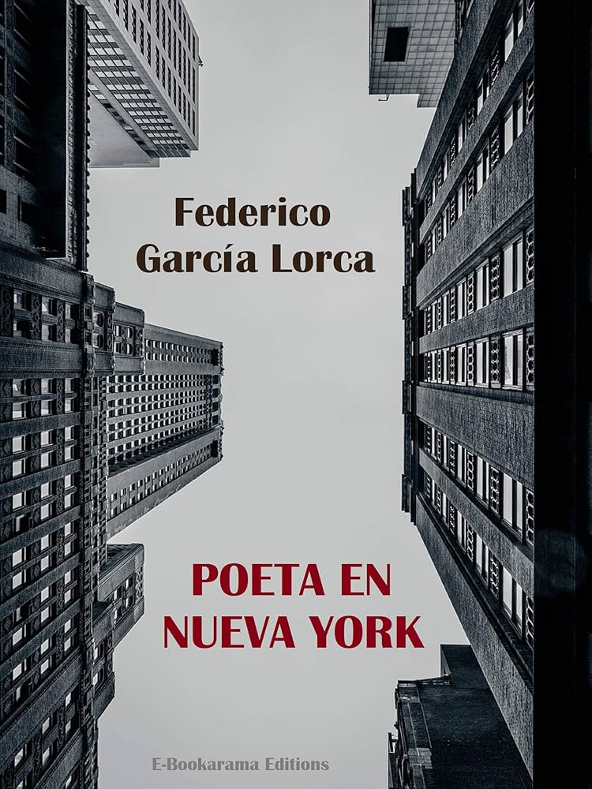
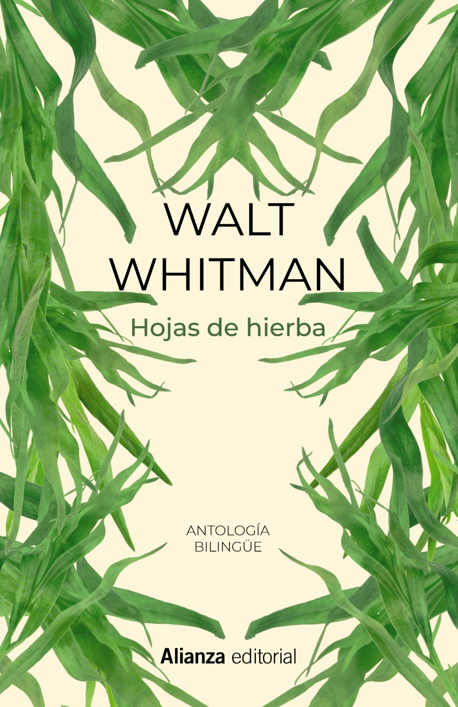
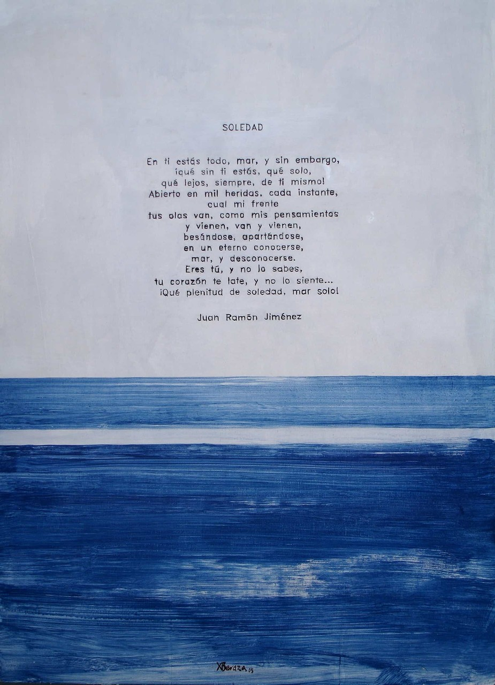

# Club de Poesía ✍️

## Agenda de Lecturas del Club

### Libros Seleccionados para Este Ciclo:

1. **Veinte Poemas de Amor y una Canción Desesperada** - *Pablo Neruda*  
     
   Año de Publicación: 1924  
   Género: Poesía  
   Descripción: Un libro clásico que mezcla el amor y la desesperanza en cada verso.

2. **Poeta en Nueva York** - *Federico García Lorca*  
     
   Año de Publicación: 1940  
   Género: Poesía  
   Descripción: Una obra que refleja el alma inquieta y visionaria de Lorca durante su estancia en Nueva York.

3. **Hojas de Hierba** - *Walt Whitman*  
     
   Año de Publicación: 1855  
   Género: Poesía  
   Descripción: Una colección que celebra la vida, la naturaleza y el espíritu humano.

4. **El Viaje Definitivo** - *Juan Ramón Jiménez*  
     
   Año de Publicación: 1914  
   Género: Poesía  
   Descripción: Un poema inmortal que invita a reflexionar sobre la vida y el paso del tiempo.

---

Sumérgete en el mundo de las palabras, las emociones y los versos. ¡Te esperamos! 🌺

  
  
  

 
&copy David Gutiérrez y Alberto Estepa. All rights reserved.

