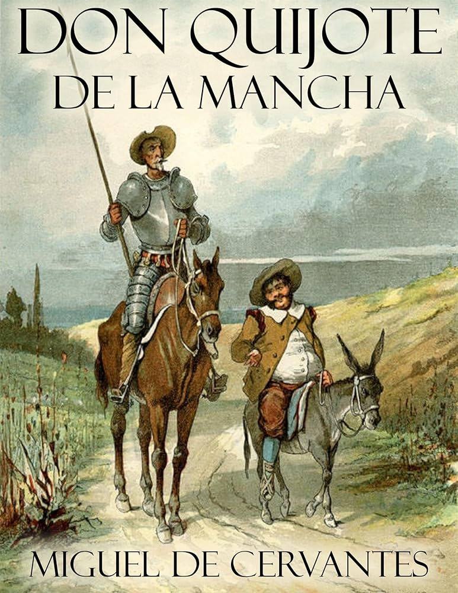
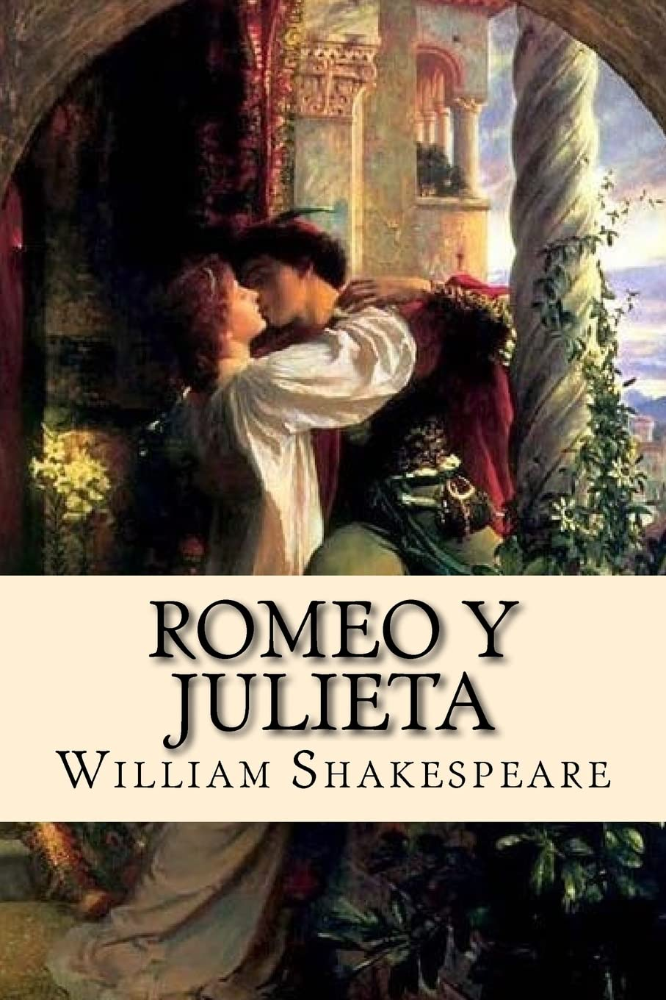

# Club de Literatura Clásica

## Agenda de Lecturas del Club

### Libros Seleccionados para Este Ciclo:

1. **La Ilíada** - *Homero*  
     
   Año de Publicación: Siglo VIII a.C.  
   Género: Épica  
   Descripción: La legendaria historia de la guerra de Troya, llena de héroes y dioses.

2. **Don Quijote de la Mancha** - *Miguel de Cervantes*  
     
   Año de Publicación: 1605  
   Género: Novela  
   Descripción: Las aventuras del caballero de la triste figura y su fiel escudero Sancho Panza.

3. **Orgullo y Prejuicio** - *Jane Austen*  
     
   Año de Publicación: 1813  
   Género: Romance  
   Descripción: Una obra maestra sobre el amor, las relaciones y los prejuicios sociales.

4. **Romeo y Julieta** - *William Shakespeare*  
     
   Año de Publicación: 1597  
   Género: Drama  
   Descripción: Una tragedia clásica sobre el amor y el destino.

---

¡Sumérgete en estas obras atemporales y descubre su relevancia hoy en día!

  
  
  

 
&copy David Gutiérrez y Alberto Estepa. All rights reserved.

