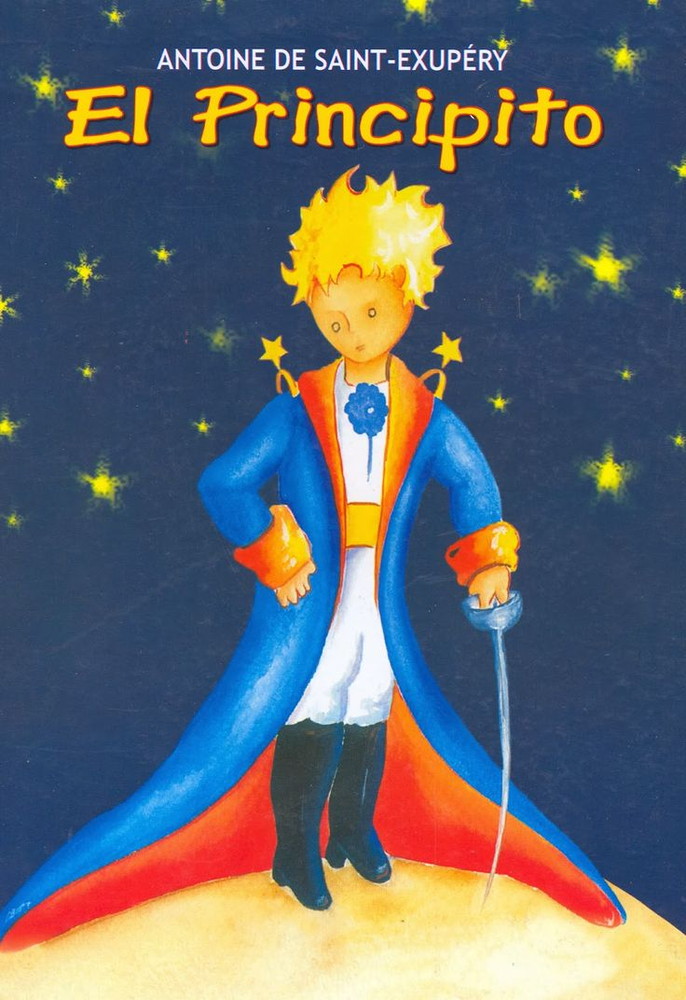
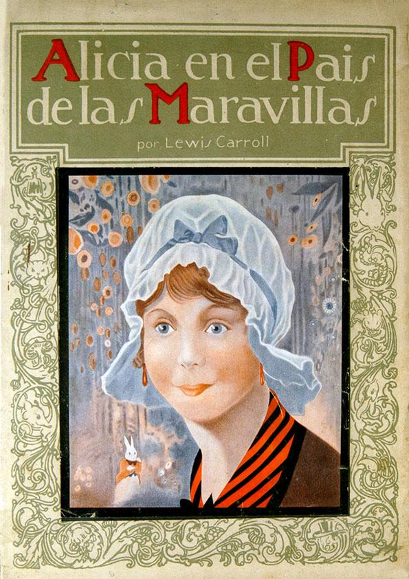
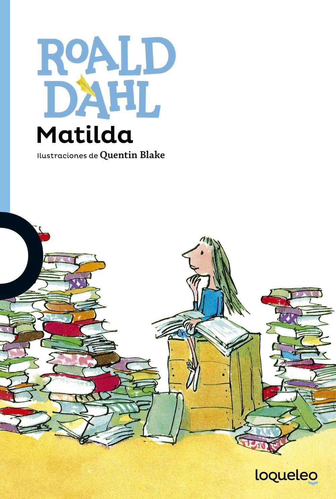
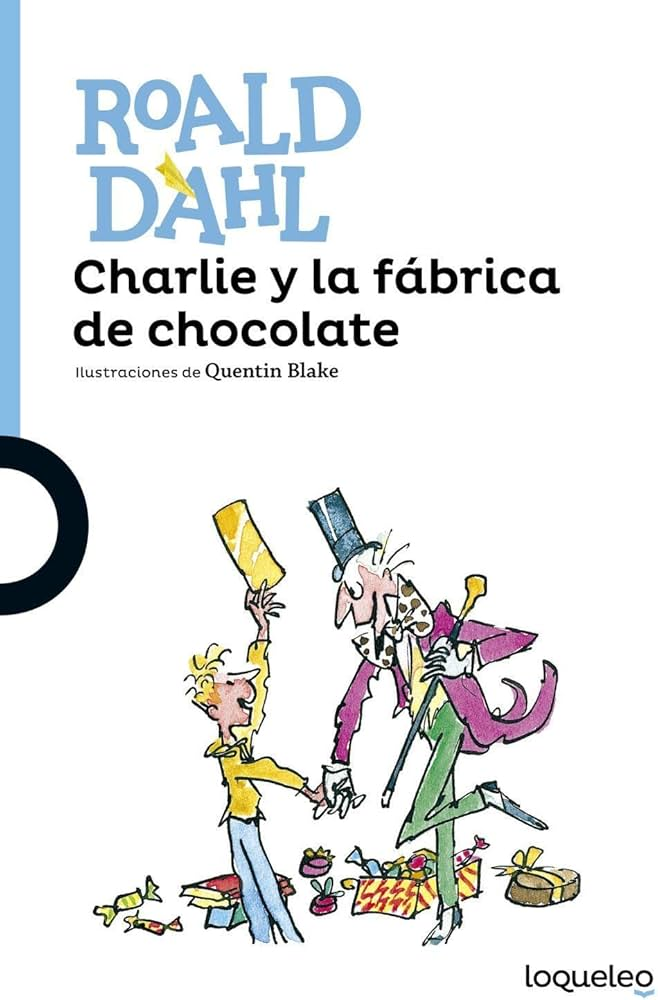

# Club de Lectura Infantil 📚

## Agenda de Lecturas del Club

### Libros Seleccionados para Este Ciclo:

1. **El Principito** - *Antoine de Saint-Exupéry*  
     
   Año de Publicación: 1943  
   Género: Fábula, Filosofía  
   Descripción: Una maravillosa historia llena de enseñanzas sobre la vida y la amistad.

2. **Alicia en el País de las Maravillas** - *Lewis Carroll*  
     
   Año de Publicación: 1865  
   Género: Fantasía  
   Descripción: Un clásico que transporta a los pequeños lectores a un mundo de fantasía y asombro.

3. **Matilda** - *Roald Dahl*  
     
   Año de Publicación: 1988  
   Género: Literatura Infantil  
   Descripción: La historia de una niña excepcional que encuentra su poder en los libros y la inteligencia.

4. **Charlie y la Fábrica de Chocolate** - *Roald Dahl*  
     
   Año de Publicación: 1964  
   Género: Fantasía Infantil  
   Descripción: Un relato encantador lleno de magia, dulces y lecciones importantes.

---

¡Prepárate para sumergirte en estas lecturas junto a otros pequeños aventureros! 🌟
