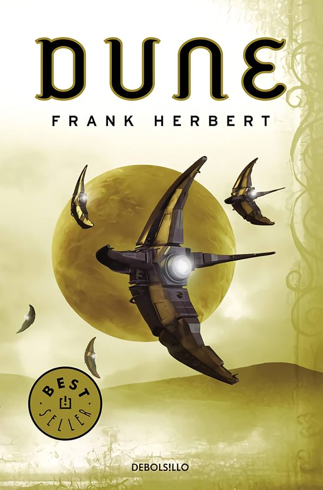

# Club de Ciencia Ficción y Fantasía

## Agenda de Lecturas del Club

### Libros Seleccionados para Este Ciclo:

A continuación, encontrarás una lista de libros recomendados que serán el centro de nuestras actividades en el club. Cada libro incluye su portada y detalles relevantes.

1. **Dune** - *Frank Herbert*  
     
   Año de Publicación: 1965  
   Género: Ciencia Ficción  
   Descripción: Una obra maestra que explora temas políticos, ecológicos y religiosos en un mundo desértico.

2. **Neuromante** - *William Gibson*  
     
   Año de Publicación: 1984  
   Género: Ciberpunk  
   Descripción: El clásico del ciberpunk que marcó el inicio de una nueva era en la literatura de ciencia ficción.

3. **Fahrenheit 451** - *Ray Bradbury*  
     
   Año de Publicación: 1953  
   Género: Distopía  
   Descripción: Una historia que cuestiona la censura y la importancia de los libros en una sociedad futurista.

4. **La Guerra de los Mundos** - *H.G. Wells*  
     
   Año de Publicación: 1898  
   Género: Ciencia Ficción  
   Descripción: Un relato visionario sobre la invasión extraterrestre.

---

¡Únete al debate y comparte tus impresiones sobre estas fascinantes lecturas!

  
  
  

 
&copy David Gutiérrez y Alberto Estepa. All rights reserved.

