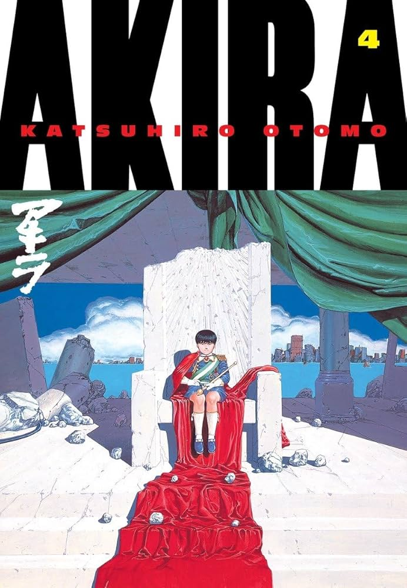
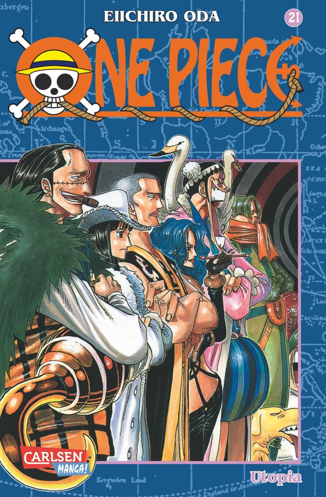

# Club de Manga

## Agenda de Lecturas del Club

### Libros Seleccionados para Este Ciclo:

A continuación, encontrarás una lista de mangas recomendados para explorar y disfrutar en este club.

1. **Akira** - *Katsuhiro Otomo*  
     
   Año de Publicación: 1982  
   Género: Ciencia Ficción  
   Descripción: Un clásico del manga que combina acción y distopía en un mundo post-apocalíptico.

2. **One Piece** - *Eiichiro Oda*  
     
   Año de Publicación: 1997  
   Género: Aventura  
   Descripción: La historia épica de un grupo de piratas en busca de un tesoro legendario.

3. **Ataque a los Titanes** - *Hajime Isayama*  
     
   Año de Publicación: 2009  
   Género: Acción, Drama  
   Descripción: Una lucha épica entre la humanidad y misteriosos gigantes devoradores.

4. **Death Note** - *Tsugumi Ohba y Takeshi Obata*  
     
   Año de Publicación: 2003  
   Género: Suspenso  
   Descripción: Un thriller psicológico sobre un cuaderno que otorga el poder de matar a quien sea.

---

¡Explora estas historias y comparte tus opiniones con la comunidad!

<a href="../mi_perfil.md" style=" color: lightgreen ;display: block;text-align: right;">volver a mi perfil</a>

----

 
&copy David Gutiérrez y Alberto Estepa. All rigts reserved.

