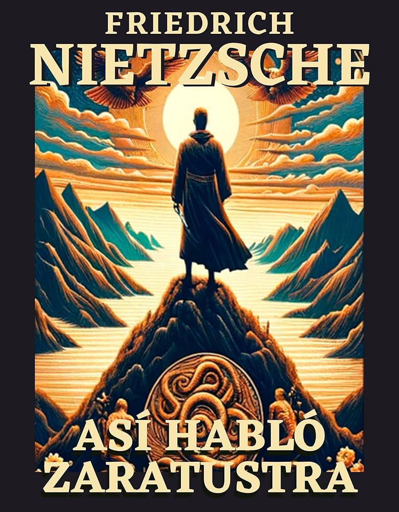

# Club de Ensayos Filosóficos

## Agenda de Lecturas del Club

### Libros Seleccionados para Este Ciclo:

1. **El Contrato Social** - *Jean-Jacques Rousseau*  
     
   Año de Publicación: 1762  
   Género: Filosofía Política  
   Descripción: Un análisis profundo sobre la libertad y la organización política.

2. **Meditaciones Metafísicas** - *René Descartes*  
     
   Año de Publicación: 1641  
   Género: Filosofía  
   Descripción: Una exploración del pensamiento humano y la existencia.

3. **Así habló Zaratustra** - *Friedrich Nietzsche*  
     
   Año de Publicación: 1883  
   Género: Filosofía  
   Descripción: Reflexiones poéticas y filosóficas sobre la humanidad y la moral.

4. **La Ética Nicomáquea** - *Aristóteles*  
     
   Año de Publicación: Siglo IV a.C.  
   Género: Filosofía Ética  
   Descripción: Un tratado sobre la felicidad y la virtud humana.

---

¡Comparte tus ideas y reflexiones en nuestras sesiones de debate!

<a href="../mi_perfil.md" style=" color: lightgreen ;display: block;text-align: right;">volver a mi perfil</a>

----

 
&copy David Gutiérrez y Alberto Estepa. All rigts reserved.

