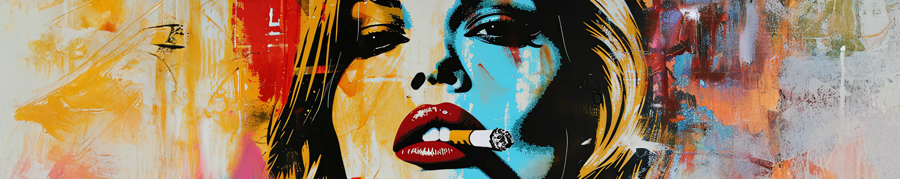
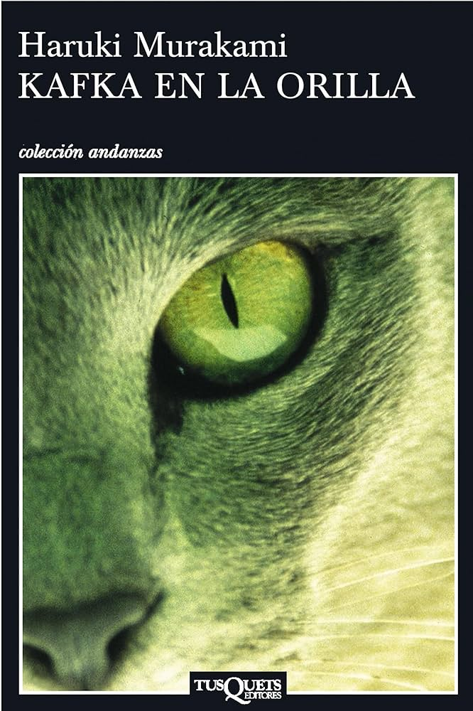
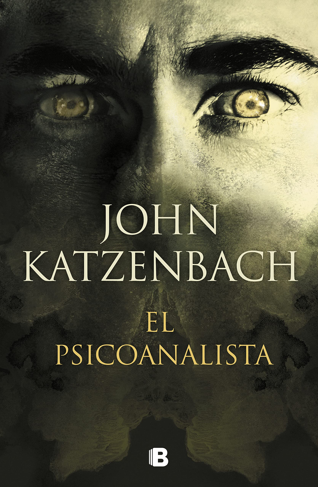

# Club de Literatura Contemporánea

## Agenda de Lecturas del Club

### Libros Seleccionados para Este Ciclo:

1. **Kafka en la Orilla** - *Haruki Murakami*  
     
   Año de Publicación: 2002  
   Género: Realismo Mágico  
   Descripción: Una historia surrealista llena de misterio y emociones.

2. **El Nombre del Viento** - *Patrick Rothfuss*  
     
   Año de Publicación: 2007  
   Género: Fantasía Épica  
   Descripción: La fascinante historia de Kvothe, un joven prodigio que busca desentrañar los misterios de su pasado.

3. **La Casa de los Espíritus** - *Isabel Allende*  
     
   Año de Publicación: 1982  
   Género: Realismo Mágico  
   Descripción: Una saga familiar que combina historia, amor y magia.

4. **El Psicoanalista** - *John Katzenbach*  
     
   Año de Publicación: 2002  
   Género: Thriller Psicológico  
   Descripción: Un thriller que mantiene al lector en vilo hasta el final.

---

¡Disfruta de estas obras y comparte tus impresiones con los demás!

<a href="../mi_perfil.md" style=" color: lightgreen ;display: block;text-align: right;">volver a mi perfil</a>

----

 
&copy David Gutiérrez y Alberto Estepa. All rigts reserved.

