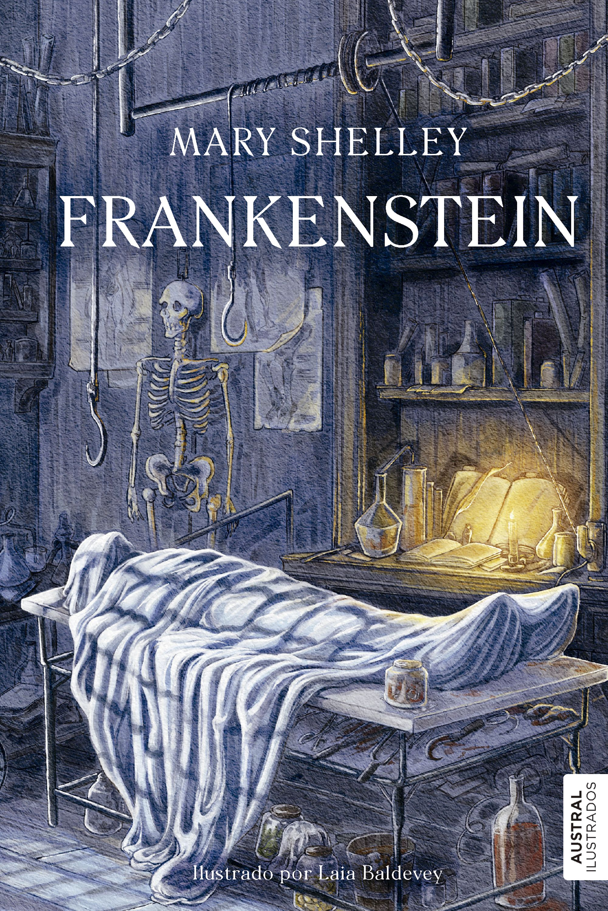
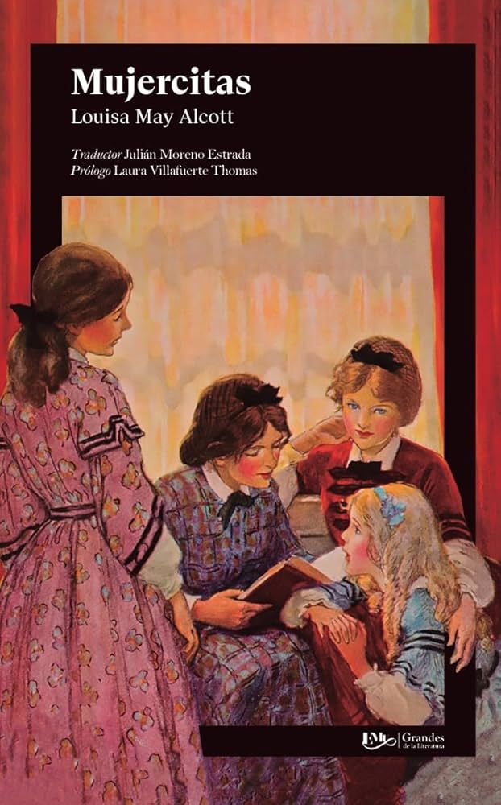

# Club de Mujeres Escritoras
[ir a mi perfil](../../mi_perfil.md)

[ir a mis libros](../../03_Libros/mis_libros.md)

## Agenda de Lecturas del Club

### Libros Seleccionados para Este Ciclo:

1. **Frankenstein** - *Mary Shelley*  
     
   Año de Publicación: 1818  
   Género: Ciencia Ficción  
   Descripción: Una historia revolucionaria sobre la ética y la creación.

2. **Mujercitas** - *Louisa May Alcott*  
     
   Año de Publicación: 1868  
   Género: Novela  
   Descripción: Una entrañable narración sobre las hermanas March y sus vivencias.

3. **La Campana de Cristal** - *Sylvia Plath*  
     
   Año de Publicación: 1963  
   Género: Drama  
   Descripción: Una novela sobre las luchas internas de la protagonista.

4. **La Casa de los Espíritus** - *Isabel Allende*  
     
   Año de Publicación: 1982  
   Género: Realismo Mágico  
   Descripción: Un relato fascinante lleno de historia y elementos mágicos.

---

¡Celebremos el talento de las mujeres escritoras en cada página!

[ir a mi perfil](../../mi_perfil.md)

[ir a mis libros](../../03_Libros/mis_libros.md)

  
  
  

 
&copy David Gutiérrez y Alberto Estepa. All rights reserved.

