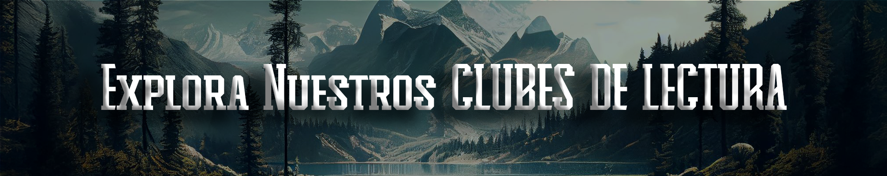
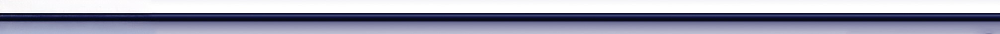
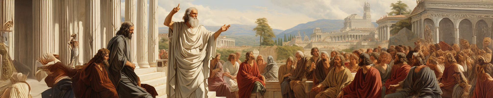
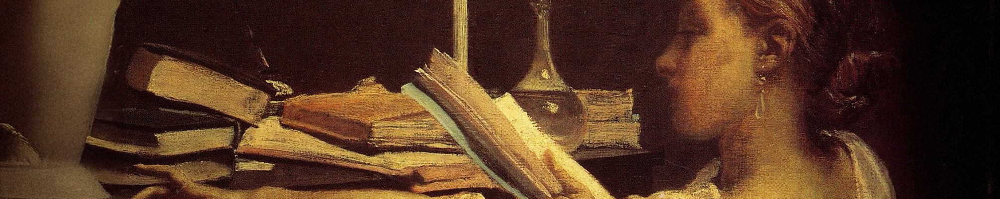
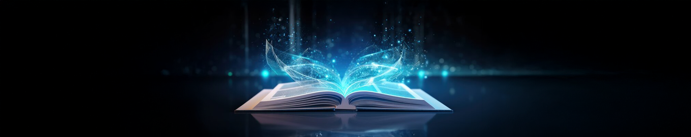

# Clubes 

- [Clubes](#clubes)
- [**Club de Ciencia Ficción y Fantasía**](#club-de-ciencia-ficción-y-fantasía)
- [**Club de Manga**](#club-de-manga)
- [**Club de Literatura Clásica**](#club-de-literatura-clásica)
- [**Club de Ensayos Filosóficos**](#club-de-ensayos-filosóficos)
- [**Club de Literatura Contemporánea**](#club-de-literatura-contemporánea)
- [**Club de Mujeres Escritoras**](#club-de-mujeres-escritoras)
- [**Club de Divulgación Científica**](#club-de-divulgación-científica)
- [**Club de Lectura Infantil**](#club-de-lectura-infantil)
- [**Club de Poesía**](#club-de-poesía)

----

# **Club de Ciencia Ficción y Fantasía**

**Bienvenidos al Club de Ciencia Ficción**

¿Te apasiona explorar futuros alternativos, viajes extraordinarios y mundos llenos de imaginación? Únete al Club de Ciencia Ficción, un espacio para los amantes de las grandes historias que desafían los límites de lo posible.

📚 En nuestras reuniones, leeremos y discutiremos obras clásicas y modernas de autores visionarios como *Julio Verne*, el maestro de los viajes increíbles; *George Orwell*, con sus inquietantes distopías; *Philip K. Dick*, creador de realidades alternativas que inspiran; y el incomparable arte narrativo de *Moebius*, entre muchos otros.

✨ Aquí encontrarás un lugar para compartir ideas, debatir temas profundos y conectar con otros exploradores de la ciencia ficción. ¡Prepárate para viajes únicos a través de la imaginación!

¡La aventura comienza pronto! 🚀

<a href="https://chat.whatsapp.com/LCPSNb9qpbU6BA7hM1OGof" target="_blank">ÚNETE AL CLUB DE CIENCIA FICCIÓN</a>

# **Club de Manga**  

 ¡Bienvenidos al **Club de Lectura de Manga!** 🌸✨

Este es un espacio creado para quienes disfrutan sumergirse en las fascinantes historias del manga. Nos dedicamos a leer, compartir y analizar obras que van desde los géneros más conocidos, como el shōnen, shōjo o seinen, hasta subgéneros específicos como el isekai, el yuri o el slice of life.

📚 ¿Qué hacemos?

* Exploramos tanto clásicos como One *Piece* o *Akira*, así como títulos menos conocidos que merecen nuestra atención.
* Compartimos ideas sobre el arte, la narrativa y los temas culturales reflejados en las historias.
* Nos aventuramos en diversos géneros, desde fantasía épica y romance hasta terror psicológico y comedia.

💬 ¿Por qué unirte?

Porque el manga es más que entretenimiento: es una ventana a mundos únicos y una forma de conectar con otros apasionados. ¡Te esperamos para compartir tus mangas favoritos y descubrir otros que te sorprenderán!

<a href="https://chat.whatsapp.com/JOM3QTtvIR7GE1xzbhzv9I" target="_blank">ÚNETE AL CLUB DE MANGA</a>

# **Club de Literatura Clásica**  

**¡Bienvenidos al Club de Literatura Clásica! 📜✨**

Este club está dedicado a explorar las grandes obras que han marcado la historia de nuestra literatura. Desde las epopeyas de Homero hasta las novelas de Jane Austen, aquí encontrarás un espacio para debatir y reflexionar sobre textos atemporales.

📚 Actividades del club:

* Lectura de clásicos como *La Ilíada*, *Orgullo y Prejuicio* y *Don Quijote de la Mancha*.
* Discusiones sobre el contexto histórico, cultural y literario.
* Encuentros para compartir ideas y perspectivas.

¡Redescubre los fundamentos de la literatura universal! 🌟

<a href="https://chat.whatsapp.com/Kf5rJgkYNpQKjws6oHuRMd" target="_blank">ÚNETE AL CLUB DE LITERATURA CLÁSICA</a>

# **Club de Ensayos Filosóficos**

**¡Bienvenidos al Club de Ensayos Filosóficos! 📜**

Este club es el lugar ideal para quienes buscan profundizar en el pensamiento filosófico a través de ensayos que abordan temas como la ética, la política y la naturaleza humana. Cuestiones importantes para quienes buscan ir "más allá" de lo dictado por la sociedad.

📚 Lecturas destacadas:

* El contrato social de Rousseau.
* Meditaciones metafísicas de Descartes.
* Así habló Zaratustra de Nietzsche.
* El Elemento de Ken Robinson

💡 ¿Por qué unirte? Porque la filosofía nos ayuda a comprender mejor lo complejo del mundo y nuestro lugar en él. Este espacio es perfecto para debatir y aprender con otros apasionados por el conocimiento.

<a href="https://chat.whatsapp.com/FDBlvskTFbpLKAKItF5uTF" target="_blank">ÚNETE AL CLUB DE FILOSOFÍA</a>

# **Club de Literatura Contemporánea**

**¡Bienvenidos al Club de Literatura Contemporánea! ✨**

Un club diseñado para los amantes de la literatura actual. Aquí exploramos obras que reflejan los problemas, las emociones y las esperanzas del mundo moderno. También nos adentramos en la novela negra o en thrillers de actualidad. 

📚 Qué hacemos:

* Analizamos novelas contemporáneas de autores como *Haruki Murakami, Chimamanda Ngozi Adichie y Elena Ferrante*.
* Disfrutamos de las obras como El Psicoanalista de autores como *John Katzenbach*.
* Debatimos sobre los temas y estilos narrativos de la literatura actual.

¡Atrévete a descubrir "nuevas" voces literarias! 🎉

<a href="https://chat.whatsapp.com/Bdyu4jE0SUf8vRiBOJ7UrH" target="_blank">ÚNETE AL CLUB DE LITERATURA CONTEMPORÁNEA</a>

 
# **Club de Mujeres Escritoras**  

**¡Bienvenidos al Club de Mujeres Escritoras! ✨**

Un club dedicado a celebrar el trabajo de mujeres escritoras a lo largo de la historia. Desde *Mary Shelley* hasta *Isabel Allende*, exploramos obras que han enriquecido la literatura global.

📚 Actividades:

* Lecturas destacadas como Frankenstein, La casa de los espíritus, y Mujercitas.
* Charlas sobre la representación femenina en la literatura.

¡Únete y sé parte de esta comunidad inspiradora! 🌸

<a href="https://chat.whatsapp.com/GMTMoha5Zb31fN1RvIRtNv" target="_blank">ÚNETE AL CLUB DE MUJERES ESCRITORAS</a>

# **Club de Divulgación Científica**  

**¡Bienvenidos al Club de Divulgación Científica! 💡**

Para los * curiosos del mundo de la ciencia* . Este club se centra en libros que explican conceptos científicos de manera clara y entretenida.

📚 Lecturas recomendadas:

*  Breve historia del tiempo de Stephen Hawking.
*  El gen egoísta de Richard Dawkins.
*  Sapiens de Yuval Noah Harari.

💬 Comparte tus descubrimientos y aprende de otros en un ambiente colaborativo. 🌍

<a href="https://chat.whatsapp.com/K5W9LRyrls5DZ6qTwv91Ti" target="_blank">ÚNETE AL CLUB DE DIVULGACIÓN CIENTÍFICA</a>

# **Club de Lectura Infantil**  

**¡Bienvenidos al Club de Lectura Infantil! 💡**

Un espacio para los más pequeños y los amantes de los cuentos infantiles. Ideal para fomentar el amor por la lectura desde temprana edad.

📚 Qué hacemos:

* Lectura de clásicos infantiles como El principito o Alicia en el País de las Maravillas.
* Talleres para crear y compartir cuentos originales.

👧👦 ¡La imaginación no tiene límites en este club!

<a href="https://chat.whatsapp.com/EiVKyYBT5oIJo8QgHZ3LkG" target="_blank">ÚNETE AL CLUB DE LITERATURA INFANTIL</a>

# **Club de Poesía**  

**¡Bienvenidos al Club de Poesía! 💡**

Un rincón para los amantes de los versos. En este club, exploramos la magia de las palabras a través de grandes poetas de todas las épocas.

📚 Lecturas destacadas:

* Poesía de Pablo Neruda, Federico García Lorca, y Emily Dickinson.
* Talleres para crear y compartir poesía original.

💫 Ven a inspirarte y compartir tu pasión por la poesía.

<a href="https://chat.whatsapp.com/FMYHbahYxFa2CqOOXTcdH4" target="_blank">ÚNETE AL CLUB DE POESÍA</a>
