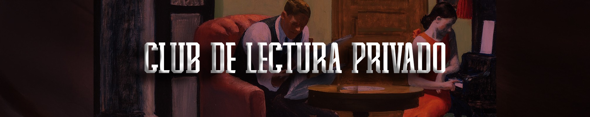

## 🎨 Bienvenido|a a un espacio exclusivo para socios
Este repositorio privado es tu puerta de entrada a una experiencia literaria única. Como miembro registrado, puedes participar en nuestras actividades, interactuar con otros lectores apasionados y disfrutar de una comunidad dedicada al amor por la lectura.

Descubre nuestros clubes temáticos, comparte tus reseñas y sumérgete en el mundo literario junto a otros socios.

Visita tu [perfil](mi_perfil.md) desde el que podrás navegar a todas las páginas y ver tu información personal.

---

## **🌟 Explora nuestros clubes literarios**
Hemos organizado una serie de clubes según temáticas y géneros para que encuentres el que mejor se adapta a ti. Cada club cuenta con un grupo de WhatsApp donde podrás debatir, compartir opiniones y proponer nuevas lecturas.

📖 Visita el archivo [`README.md`](01%20Clubes/README.md) dentro de la carpeta `Clubes` para informarte sobre los clubes disponibles y unirte al que más te interese.

---

## **✨ Ventajas de ser socio**
Como miembro del Club de Lectores, tienes acceso a:

- Una comunidad exclusiva de amantes de la literatura.
- Clubes organizados por géneros literarios y temáticas.
- Actividades grupales como lecturas conjuntas y debates literarios.
- Grupos de WhatsApp para interactuar con otros lectores.
- La posibilidad de proponer nuevos títulos y coordinar actividades.

¡Aprovecha al máximo tu membresía y haz de la lectura una experiencia compartida! 📚

---

## **💬 Contáctanos**
¿Tienes dudas, consultas o sugerencias? Estamos aquí para ayudarte.  

  

  

  

Además, puedes resolver tus dudas directamente en el grupo de WhatsApp del club al que te hayas unido.

---

¡Gracias por formar parte de nuestra
