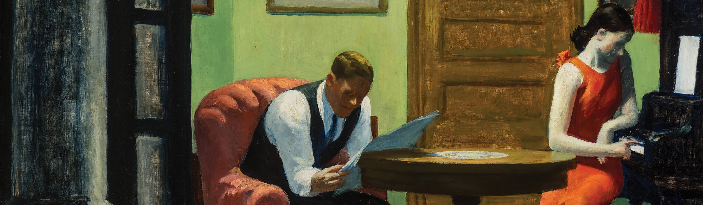

# ¡BIENVENIDO|A AL CLUB DE LECTORES!

## Información
Bienvenidos al Club de Lectores, un espacio dedicado a todos los amantes de los libros y la literatura. Aquí nos reunimos para compartir nuestra pasión por la lectura, descubrir nuevas obras, debatir sobre nuestras lecturas favoritas y explorar géneros literarios variados. Ya seas un lector ávido o alguien que busca adentrarse en el fascinante mundo de los libros, este club es el lugar perfecto para ti. Juntos, disfrutaremos de cada historia, aprenderemos de diferentes perspectivas y fomentaremos un ambiente donde todos puedan expresarse libremente. ¡Únete y acompáñanos en este viaje literario!

<a href="Usuarios/user_register.md" style="text-decoration: none; padding: 10px 20px; background-color: white; color: #007BFF; border: 2px solid #007BFF; border-radius: 5px; font-size: 16px; text-transform: uppercase; font-family: Arial, sans-serif;"><b>¿DESEAS SER SOCIO | A?</b></a>

  

<a href="Libros/book_register.md" style="text-decoration: none; padding: 10px 20px; background-color: white; color: #007BFF; border: 2px solid #007BFF; border-radius: 5px; font-size: 16px; text-transform: uppercase; font-family: Arial, sans-serif;"><b>REGRISTRA UN LIBRO</b></a>

  

¿Ya tienes un usuario?

Accede a tu repositorio utilizando este enlace

    //enlace a la versión 1.0 cuando salga

----
### Contáctanos

    
    
    

